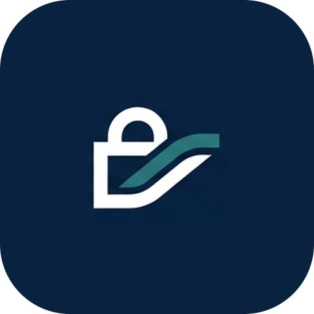

<!-- ════════════════════════════════════════════════════════════════════════ -->
<!--  ZAIN HAMID · GITHUB PROFILE · borderless dark-terminal dashboard          -->
<!--  cards use bg_color=0d1117 + hide_border so they blend into GitHub's dark   -->
<!--  canvas for a seamless, borderless look. NOTE: GitHub strips inline CSS,    -->
<!--  so all rounding/theming is done via service params, never style="".        -->
<!-- ════════════════════════════════════════════════════════════════════════ -->

<a href="https://vault-flow.space">
  
</a>

<div align="center">

<!-- ── LIVE TERMINAL BOOT ─────────────────────────────────────────────── -->


<!-- ── LIVE STAT CARDS (blend into dark canvas) ───────────────────────── -->
<p>


</p>

</div>

<br/>

<!-- ════════════════════════════════════════════════════════════════════════ -->
<!--  ABOUT · terminal card (fenced block = perfectly consistent everywhere)     -->
<!-- ════════════════════════════════════════════════════════════════════════ -->

```ansi
[36m┌─[ ~/zain/profile ]───────────────────────────────────────────────────┐[0m
  [32m$[0m whoami
  [37mZain Hamid — App Developer · Software Engineer · Startup Founder[0m

  [32m$[0m cat mission.txt
  [37mI build cloud products, ship cross-platform mobile apps, and[0m
  [37mengineer autonomous robotics. Obsessed with deadlines that never[0m
  [37mget missed and systems that never go offline.[0m

  [32m$[0m systemctl status --user
  [36m●[0m vaultflow.service    [32mactive (running)[0m   founder & ceo
  [36m●[0m mobile.pipeline      [32mactive (running)[0m   react-native · ios + android
  [36m●[0m ftc.robotics         [32mactive (running)[0m   java autonomous · outreach
[36m└───────────────────────────────────────────────────────────────────────┘[0m
```

<br/>

<!-- ════════════════════════════════════════════════════════════════════════ -->
<!--  VAULTFLOW SPOTLIGHT                                                         -->
<!-- ════════════════════════════════════════════════════════════════════════ -->

<div align="center">

</div>

<table align="center" width="100%">
<tr>
<td width="30%" align="center" valign="middle">



<br/>

<a href="https://vault-flow.space">

</a>

</td>
<td width="70%" valign="middle">

```yaml
company:   VaultFlow
role:      Founder & Chief Executive Officer
url:       https://vault-flow.space
status:    ◉ LIVE · scaling

mission: >
  A cloud ecosystem that tracks document lifecycles and
  subscription renewals — surfacing every deadline BEFORE
  it expires, never after.

stack:
  - document_lifecycle_tracking   # ingest → monitor → alert
  - subscription_renewal_engine   # proactive pre-expiry loop
  - cross_platform_cloud_sync     # always in-sync sessions
```

</td>
</tr>
</table>

<br/>

<!-- ════════════════════════════════════════════════════════════════════════ -->
<!--  PROJECT GRID · 2x2 clean bento                                             -->
<!-- ════════════════════════════════════════════════════════════════════════ -->

<div align="center">

</div>

<table align="center" width="100%">
<tr>
<td width="50%" valign="top">

### 🛰️ &nbsp;VaultFlow Cloud Portal

`prod · deployed` &nbsp; `tier · saas`

The flagship web control plane — users register documents and subscriptions, then the renewal engine works silently in the background with real-time cloud sync.

```diff
+ lifecycle dashboards & timeline views
+ automated pre-expiration scheduling
+ encrypted auth & secure storage
```


</td>
<td width="50%" valign="top">

### 📱 &nbsp;Mobile App Engineering

`build · shipping` &nbsp; `cross-platform`

Native-feeling experiences from a single reactive codebase — obsessive focus on fluid motion, gesture UX, and battery-friendly performance.

```diff
+ clean reactive view-model architecture
+ low-latency state management
+ 60fps · gesture-driven · offline-first
```


</td>
</tr>
<tr>
<td width="50%" valign="top">

### ⚙️ &nbsp;FTC — Control Engineering

`subsystem · hardware` &nbsp; `java`

Where mechanical hardware meets deterministic software — I architect the robot's brain, from raw motor signals to autonomous decisions.

```diff
+ multi-motor chassis & drivetrain kinematics
+ sensor arrays (IMU · encoders · color)
+ Java autonomous routines & PID control
```


</td>
<td width="50%" valign="top">

### 📈 &nbsp;FTC — Business & Outreach

`subsystem · operations` &nbsp; `growth`

Running a competitive robotics team is running a startup — I drive funding, brand, docs, and community outreach that keeps the hardware division on the field.

```diff
+ sponsorship formulation & pitch decks
+ engineering documentation pipelines
+ community outreach & STEM marketing
```


</td>
</tr>
</table>

<br/>

<!-- ════════════════════════════════════════════════════════════════════════ -->
<!--  TECH STACK                                                                 -->
<!-- ════════════════════════════════════════════════════════════════════════ -->

<div align="center">


<br/><br/>

**`languages & app frameworks`**

<br/>


<br/><br/>

**`cloud backend & dev suites`**

<br/>


</div>

<br/>

<!-- ════════════════════════════════════════════════════════════════════════ -->
<!--  GITHUB ANALYTICS · borderless cards (bg matches dark canvas)               -->
<!-- ════════════════════════════════════════════════════════════════════════ -->

<div align="center">


<br/><br/>


<br/>


<br/><br/>


<br/><br/>


<br/><br/>

<!-- contribution snake · needs Platane/snk action enabled on this repo -->


</div>

<br/>

<!-- ════════════════════════════════════════════════════════════════════════ -->
<!--  SYSTEM OPS LOG                                                             -->
<!-- ════════════════════════════════════════════════════════════════════════ -->

<div align="center">

</div>

<br/>

```bash
[  OK  ]  system.runtime .................  24/7 uptime · always compiling
[  OK  ]  env.DARK_MODE ..................  export DARK_MODE=always
[  OK  ]  env.EDITOR .....................  export EDITOR=cursor    # AI-native
[  OK  ]  cron.vaultflow_scaling .........  */5 * * * *   marketing_loop.sh --scale
[  OK  ]  cron.renewal_engine ............  0 * * * *     scan --pre-expiry --notify
[  OK  ]  cron.mobile_pipeline ...........  0 */6 * * *   build --cross-platform
[  OK  ]  cron.ftc_outreach ..............  0 9 * * 1-5   send --sponsors --community
[  OK  ]  deploy.region ..................  edge · multi-region cloud
[ WARN ]  sleep.daemon ...................  DEFERRED — too busy building 🚀
[  OK  ]  all systems ....................  OPERATIONAL · 0 blockers
```

<br/>

<!-- ════════════════════════════════════════════════════════════════════════ -->
<!--  CONTACT · FOOTER                                                           -->
<!-- ════════════════════════════════════════════════════════════════════════ -->

<div align="center">


<br/><br/>

<a href="https://www.linkedin.com/in/zain-hamid-390523393/"></a>
<a href="https://www.instagram.com/zainy_2012/"></a>
<a href="mailto:zhworldchannel@gmail.com"></a>
<a href="https://vault-flow.space"></a>

<br/><br/>


</div>


