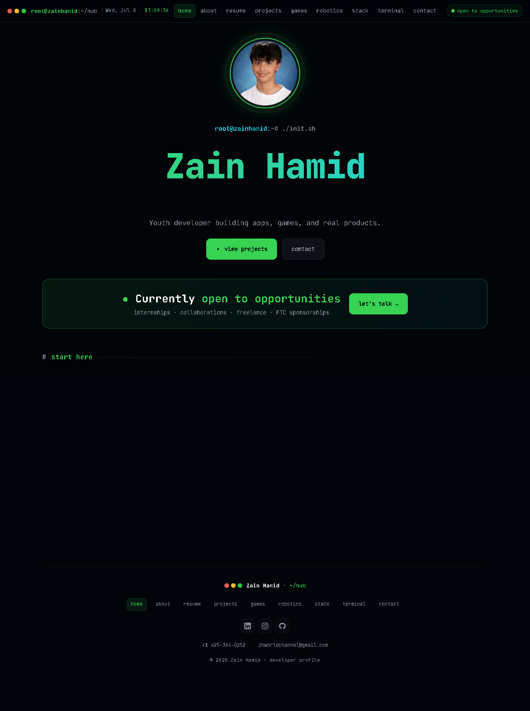

<!-- ══════════════════════════════════════════════════════════════════════ -->
<!--  ZAIN HAMID · zhworldchannel-byte                                      -->
<!--  Profile README → preview + launch button for the live HTML dashboard -->
<!-- ══════════════════════════════════════════════════════════════════════ -->

  

<!-- ── LIVE STATUS ── -->

  

<!-- ══════════  LAUNCH THE INTERACTIVE DASHBOARD  ══════════ -->

### `>` I built a live, interactive terminal dashboard

terminal aesthetic · matrix rain · boot screen · projects · games · résumé · contact

  

<!-- clickable preview → opens the live site -->

 

▲ click the preview to open the live version

<!-- ── ABOUT ── -->

I'm **Zain Hamid** — a **Founder / App Developer / Software Engineer** shipping **[VaultFlow](https://vault-flow.space)**, a cloud ecosystem that tracks document lifecycles &amp; subscription renewals and flags every expiry **before** it lapses. Off-keyboard, I run the control-engineering **and** business side of a **FIRST Tech Challenge** robotics team.

 

<!-- ── QUICK TELEMETRY ── -->

<!-- ── CONTACT ── -->

  

